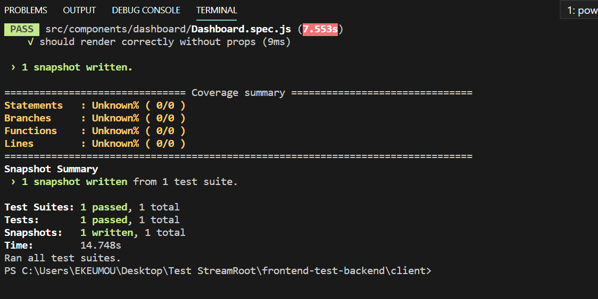

This project was create for a technical test.

`Names`: `Ulrich EKEU MONKAM`

`Email`: `ekeuulrich2@gmail.com`

`status`: `Student at EFREI Paris`

`Major`: `Software Engineering`

`Level`: `Master's 1`

`Node version` : `v12.13.1`

# Project Overview

Regarding this project I am first going to detail out the list of libraries I made use of, what was done and what wasn't due to lack of time.

### `Libraries and Frameworks`

1. `axios`
   - A Promise base HTTP client to make requests to my BackEnd Node JS server.
1. `React JS`
   - JavaScript library for building user interfaces.
1. `Redux`
   - JavaScript library for managing application state.
1. `Redux Thunk`
   - Middleware enabling you to call action creators returning functions rather than objects.
1. `Jest`
   - JavaScript Testing Framework.
1. `Enzyme`
   - JavaScript Testing Utility made specifically for react to test components' output.
1. `Webpack and Babel`
   - For code building.
1. `Prettier + eslint`
   - For code standard and for cleanliness.

There may be others but those were the main ones are made use of.

### `What was done`

At first when I started coding i didn't at first sight tried analysing the BackEnd server to see that it wasn't real data so I added some functionnalities that I really like at the end.

1. Starting with the `Landing Page` there are two main functionnalities, that is; the `Sign Up` and `Sign In` links.

   - At first just like I said, at first sight i didn't analyze the BackEnd to see that there wasn't a route for registration so I directly created a connection a `Mongo Database` endpoint for client registration.

   `config/db.js`

   ```javascript
   //Mongoose: A library to manage connections between mongo db and Node JS
   const mongoose = require('mongoose');
   // Config: A dependency for managing global variables
   const config = require('config');
   const db = config.get('mongoURI');
   //Connecting to my database
   const connectDB = async () => {
     try {
       await mongoose.connect(db, {
         useUnifiedTopology: true,
         useNewUrlParser: true,
       });
       console.log('MongoDB Connected...');
     } catch (error) {
       console.log(error.message);
       //Exit process with failure
       process.exit(1);
     }
   };
   ```

   `config/default.json`

   ```json
   {
     "mongoURI": "Database Endpoint",
     "jwtSecret": "Secret Key for Token Generation"
   }
   ```

   This was an added functionnality. So since there was no route for client registration, I added one, that is the `/api/user` that I added to the BackEnd server and called making user of `react`,  `redux` and  `axios`.

   `user.js`

   ```javascript
   //Contains feature like registering users, adding users etc
    const express = require('express');
    const router = express.Router();
    const gravatar = require('gravatar');
    const bcrypt = require('bcryptjs');
    const jwt = require('jsonwebtoken');
    const config = require('config');
    const { check, validationResult } = require('express-validator');

    const User = require('../../models/User');

    // @route   POST api/users
    // @desc    Register user
    // @access  Public
    router.post(
    '/',
    [
        check('fname', 'First Name is required').not().isEmpty(),
        check('lname', 'Last Name is required').not().isEmpty(),
        check('website', 'Website is required').not().isEmpty(),
        check('description', 'Decription is required').not().isEmpty(),
        check('email', 'Please include a valid email').isEmail().normalizeEmail(),
        check(
        'password',
        'Password should not be empty, with a minimum of eight characters'
        )
        .isLength({ min: 6 })
    ],
    async (req, res) => {
        console.log(req.body);
        const errors = validationResult(req);
        if (!errors.isEmpty()) {
        return res.status(400).json({ errors: errors.array() });
        }

        const { fname, lname, email, website, description, password } = req.body;

        try {
        //See if user exists
        let user = await User.findOne({ email });

        if (user) {
            return res
            .status(400)
            .json({ errors: [{ message: 'User already exists' }] });
        }

        //Get users gravatar
        const avatar = gravatar.url(email, {
            s: '200',
            r: 'pg',
            d: 'identicon',
        });

        user = new User({
            fname,
            lname,
            email,
            website,
            description,
            avatar,
            password,
        });

        //Encrypt password
        const salt = await bcrypt.genSalt(12);

        user.password = await bcrypt.hash(password, salt);

        await user.save();

        //Return jswonwebtoken
        const payload = {
            user: {
            id: user.id,
            },
        };
        jwt.sign(
            payload,
            config.get('jwtSecret'),
            { expiresIn: 360000 },
            (error, token) => {
            if (error) throw error;
            res.json({ token });
            }
        );
        } catch (error) {
        console.error(error.message);
        res.status(500).send('Server error!');
        }
    }
    );

    module.exports = router;

   ```

   That said, after realizing I had to take time and understand first, for the `Sign In` I clearly made use of your route (`/auth`).

1. Moving on when the client has signed in, he has access to his `Dashboard` and has the ability to update his `Profile` (First `/myinfo` to get current user and `/updateinfo` to update user).

1. Within the `Dashboard` the user can only view two charts (`cdn vs p2P` and `concurrent viewers`). I made use here of the `/bandwidth` and `/audience` routes. The dashbord is only accessible to registered or signed in users.

1. Client ability to `Log out` (`/logout`)

1. The `Tests`. I was really stressed up with this part; because knowing that this is a crucial part and I never dis tests before in react. I had serious issues trying to set up jest, I had all forms of errors like `regeneratorRuntime is not defined` issues with testing a component receiving props etc. Nevertheless, I finally ended up by successfully setting up my project and succeeding to atleast having one test that succeeded.

    Here is what I did:

    1. I first configured babel in my project by adding a `.bablrc` where all the necessary plugins are added and where I added my test environment `env`
    1. From there at the root of my project I created a `tools\config\test` folder containing configuration files mainly for providing coverage analysis.
    1. Within the same folder I created a test init file called `enzyme.js`
    1. All that being set up I added that to the `scipts` in my `package.json`

        ```json
            "jest": "cross-env BABEL_ENV=test jest -u --config ./tools/config/test/jest.cover.json"
        ```

    1. I just stated out the most important steps that i did but all the essential libries like `jest-environment-jsdom-global`, `enzyme-adapter-react-16`, `babel-jest` that i made use of can be found in my `package.json`.

    After this setup,

    1. I took the component I wanted to test, that is `Dashboard.js`
    1. Within the same folder i created a `spec` file named `Dashboard.spec.js`. You can also name it `Dashboard.test.js`. Jest understands both
    1. The first thing i did was to extract my props functions.

        ``` javascript
                    let [
        extractCurrentClient,
        extractchartData,
        extractConcurrentViewers,
        ] = new Array(3).fill(jest.fn());
        ```

    1. I then created a function in which I mock/simulate props (properties) same as those I pass on to my component.

        ``` javascript
            function setup() {
                const props = {
                    auth: {
                    user: {
                        lname: 'Ulrich',
                    },
                    },
                    profile: {
                    profile: {
                        fname: 'Ulrich',
                        lname: 'Ekeu',
                        email: 'hello@gmail',
                        website: 'website.com',
                        description: 'Hello Ulrich',
                    },
                    loading: true,
                    },
                    chart: {
                    cdn: [
                        [1234, 123],
                        [1234, 123],
                        [1234, 123],
                    ],
                    p2p: [
                        [1234, 123],
                        [1234, 123],
                        [1234, 123],
                    ],
                    maxSum: 345.5,
                    maxCdn: 345.5,
                    },
                    viewers: {
                        concurrence: [
                            [1234, 123],
                            [1234, 123],
                            [1234, 123],
                        ]
                    },
                    extractCurrentClient: extractCurrentClient,
                    extractchartData: extractchartData,
                    extractConcurrentViewers: extractConcurrentViewers,

                    ...
                    ...
                    ...
                };
        ```

    1. And before mounting my component, I made use of the `shallow` function to tell Enzyme to ignore all child components (Still in my function)

        ``` javascript
            const enzymeWrapper = shallow(<Dashboard {...props} />);
        ```

    1. The function then returns an object containg the mocked props and my component (not containng his child components: remember I made use of `shallow`)

        ```javascript
            return {
                props,
                enzymeWrapper,
            };
        ```

    1. When using redux we make use of the store and to use the store within a component we make use of `connect`. My Dashboard makes use of that for his child components so I also had to mock that to tell jest to ignore it.

        ```javascript
            jest.mock('react-redux', () => ({ connect: () => (c) => c }));
        ```

    1. That being done i created a const that received the object from my function and all I had to do now is just create my test making use of `describe` and `it`.

        ```javascript
            const { enzymeWrapper } = setup();
            describe('Dashboard Component', () => {
            it('should render correctly without props', () => {
                expect(toJson(enzymeWrapper)).toMatchSnapshot();
            });
            });
        ```

    1. Just to explain a little `expect` tells jest what he is about to receive, `toJson` is just to put the result in a clean format and `toMatchSnapshot` is just going to create the test result in a seperate file. But one can still decide to create in the same file by using `Inline`

    This is the result of my snapshot:

    ``` bash
        // Jest Snapshot v1, https://goo.gl/fbAQLP

        exports[`Dashboard Component should render correctly without props 1`] = `
        <Fragment>
        <h1
            className="large text-primary"
        >
            Streaming
        </h1>
        <p
            className="lead"
        >
            <i
            className="fas fa-chart-line"
            />
            Welcome 
            Ulrich
        </p>
        <DashBoardActions />
        <BandWidth
            cdn={
            Array [
                Array [
                1234,
                123,
                ],
                Array [
                1234,
                123,
                ],
                Array [
                1234,
                123,
                ],
            ]
            }
            maxCdn={345.5}
            maxSum={345.5}
            p2p={
            Array [
                Array [
                1234,
                123,
                ],
                Array [
                1234,
                123,
                ],
                Array [
                1234,
                123,
                ],
            ]
            }
        />
        <Concurrent
            concurrence={
            Array [
                Array [
                1234,
                123,
                ],
                Array [
                1234,
                123,
                ],
                Array [
                1234,
                123,
                ],
            ]
            }
        />
        </Fragment>
        `;
    ```

    This is the test result:

    

### `What was not done`

Here are some of the things that I couldn't do. Honestly due to lack of time and school activities

1. The last chart (`EFFRICIENCY`). I left it intentionally because I wanted to gain some more time to read Jest documentation and learn how to implement a test in react.
1. The following routes were left out:
    - `/notifications`
    - `/countries`
    - `/isps`
    - `/platforms`
    - `/streams`

### `Remarks`

Honestly I really want to thank you guys for this awesome test. Such a serious challenge, I never had it and this help me improve in my coding abilities, increased my understanding of react and made me more eager to search and read docs and learn more.

### `Asside`

I just want to add here the different lines of code I added to the BackEnd to make use of `Mongo DB`

```javascript
    //Import database configuration
    const connectDB = require('./config/db');
    connectDB();
```

This was just for communication between Back and Front to avoid `CORS Policy` errors

```javascript
    app.use(cors());
    app.options('*', cors());
```

I also created a folder in my project called `BackEnd` were i added files and folders I made use for `Mongo DB` and in case our `token` was stored in `headers`

1. `config` folder like I stated before contains all Mongo configurations
1. `middleware` folder contains the `auth.js` file to check if user is authenticated or not by checking `x-auth-token` in the headers
1. `models` folder contains `User.js` for modeling a client to be stored in `Mongo DB`
1. And finaly the `routes\api` folders that contain:
    - `auth.js` : To get a user from database or authenticate a User.
    - `user.js` : As stated before for registration.

# Thanks For The Test
